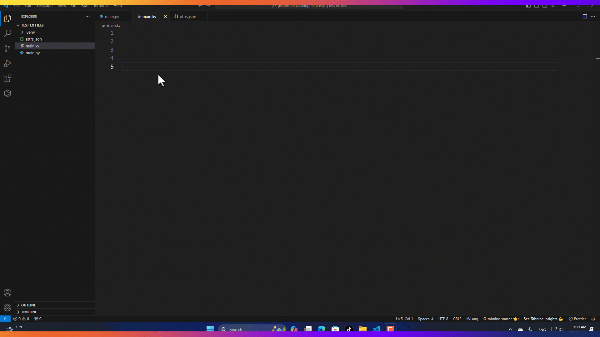

# Kivy .kv Language Helper

## Support me !

## Description

The Kivy .kv Language Helper is a Visual Studio Code extension designed to enhance your development experience when working with Kivy's .kv language files. It provides intelligent suggestions, syntax highlighting, and more, making it easier to write and manage your Kivy UI layouts.

## new Update 0.0.6

* new suggestions improvements.
* in **.py** files write **kv** then any widget name and choose one to past the import line
* in .py files click on **ctrl+alt+n** to show and choose kivy templates
* suggestions **attributes** inside Widgets in **.py** files.
* **auto** add **import** for the created widgets or classes that is not added.

## New Update 0.0.5

- added in this version a simple button run `` in the .kv files, to show your current work directly.
- or by pressing **`f5 `**button it will preview the current file.
- if you are inside any Widget, and you click on **ctrl+alt+n** then it will display all attributes of that Widget.
- video explain the new features [Youtube Video](https://www.youtube.com/watch?v=eQ0yx2RZMjM)

## New Update 0.0.4

### Exciting New Features Update!

Our latest extension update brings several powerful features to streamline your workflow. Now, with improved suggestions, you can effortlessly retrieve suggested attributes for the current object, making coding faster and more intuitive. Additionally, the extension provides suggestions for paths to folders or files, simplifying navigation within your project. The highlight of this update is the integration of a vast suggestions database in JSON format, ensuring comprehensive and accurate suggestions tailored to your development needs. Check out this [video](https://youtu.be/wlK9a249O2U) to see these features in action and experience the magic of enhanced coding productivity.

## Features

- **Syntax Highlighting:** Easily distinguish between different elements, properties, and values in your .kv files with syntax highlighting.
- **Code Suggestions:** Get code suggestions as you type, helping you autocomplete elements, properties, and attributes.
- **Improved Readability:** The extension enhances the readability of your .kv files by highlighting key elements and structures.

## Installation

1. Open Visual Studio Code.
2. Go to the Extensions view (`Ctrl+Shift+X`).
3. Search for "Kivy .kv Language Helper" and install the extension.

## Usage

1. Open a .kv file in Visual Studio Code.
2. Enjoy automatic syntax highlighting and intelligent code suggestions while you write and edit your Kivy UI layouts.

## Screenshots

## Feedback and Support

If you encounter any issues or have suggestions for improvement, please [contact me](nsitiliem@gmail.com). Your feedback is valuable to me and helps me improve the extension for everyone.

## License

This extension is licensed under the [MIT License](LICENSE.md). Feel free to use, modify, and distribute it according to the terms of the license.

---

**Note:** This extension is not affiliated with or endorsed by the Kivy project. It is an independent personal effort to enhance the development experience for Kivy users in Visual Studio Code.
